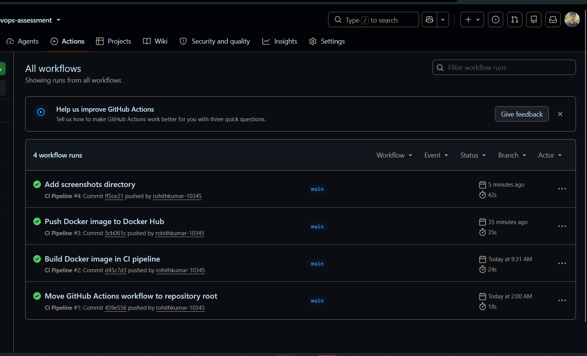
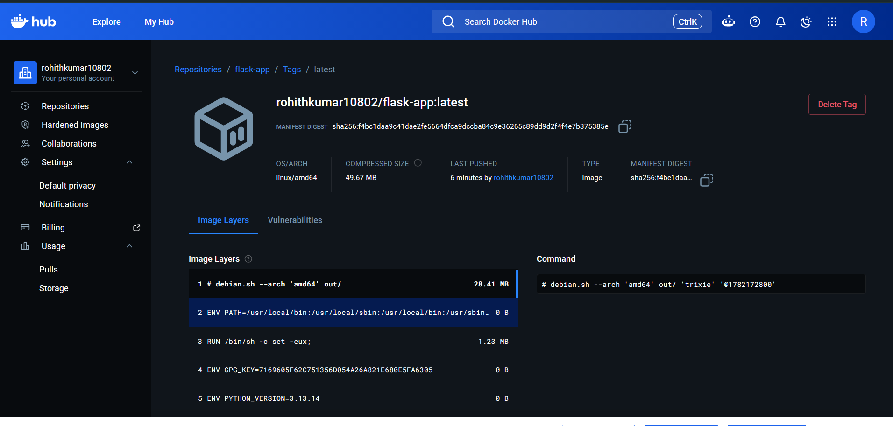

# Task 1 - Flask Application with Docker and GitHub Actions

## Overview

This task demonstrates containerizing a simple Flask application using Docker and implementing a GitHub Actions CI/CD pipeline. The pipeline automatically installs project dependencies, runs unit tests, builds the Docker image, and publishes the image to Docker Hub whenever changes are pushed to the `main` branch.

---

## Technologies Used

- Python 3.13
- Flask
- Docker
- Git
- GitHub
- GitHub Actions
- Docker Hub
- Pytest

---

## Docker Best Practices

- Used the lightweight `python:3.13-slim` base image.
- Configured a dedicated working directory.
- Installed dependencies before copying the application source to improve Docker layer caching.
- Ran the application as a non-root user.
- Exposed port `5000`.

---

## Commands Used

### Install Dependencies

```bash
pip install -r requirements.txt
```

### Run the Application

```bash
python app.py
```

### Run Unit Tests

```bash
pytest
```

### Build the Docker Image

```bash
docker build -t flask-app .
```

### Run the Docker Container

```bash
docker run -p 5000:5000 flask-app
```

### Git Commands

```bash
git add .
git commit -m "<commit message>"
git push
```

---

## CI/CD Pipeline

The GitHub Actions workflow is triggered on every push to the `main` branch.

The pipeline performs the following steps:

1. Checkout the repository.
2. Set up the Python environment.
3. Install project dependencies.
4. Run unit tests using Pytest.
5. Build the Docker image.
6. Publish the Docker image to Docker Hub.

---

## Docker Hub Repository

The Docker image is automatically published after a successful pipeline execution.

**Repository:**

```text
rohithkumar10802/flask-app
```

---

## Issues Encountered

- Initially placed the GitHub Actions workflow inside `task-1/.github/workflows`, which GitHub Actions could not detect.
- Moved the workflow to the repository root (`.github/workflows`) to enable automatic execution.

---

## Screenshots

### GitHub Actions Pipeline

Successful CI/CD pipeline execution.



---

### Docker Hub Repository

Docker image successfully published with the `latest` tag.


