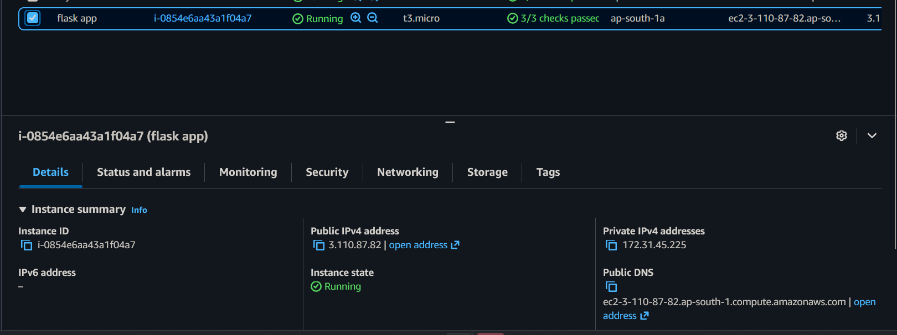
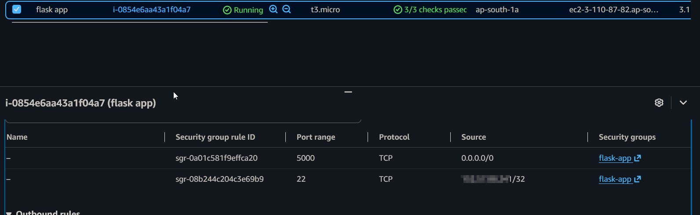
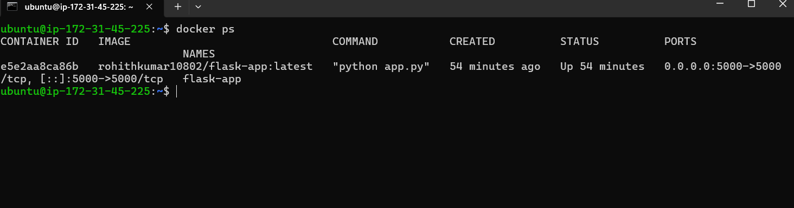
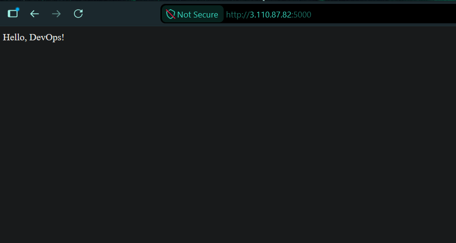
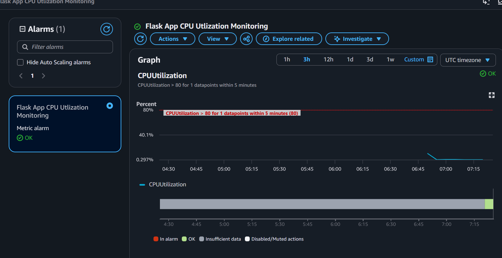

# Task 2 - Deploy Dockerized Flask Application on AWS EC2

## Objective

Deploy the Dockerized Flask application from Task 1 to an Amazon EC2 instance using Docker. Verify the application is accessible over the internet and document the deployment process.

---

## AWS Services Used

- Amazon EC2
- Amazon VPC (Default)
- Amazon Security Groups
- Docker
- Amazon CloudWatch (Bonus)
- Amazon SNS (Bonus)

---

## Deployment Steps

1. Launched an Ubuntu Server 24.04 LTS EC2 instance.
2. Configured the Security Group:
   - SSH (TCP Port 22) from **My IP**
   - Custom TCP (Port 5000) from **0.0.0.0/0**
3. Used an EC2 User Data bootstrap script to automate the instance setup.
4. Installed Docker automatically during instance launch.
5. Pulled the Docker image from Docker Hub.
6. Started the Flask container automatically.
7. Verified the deployment using SSH.
8. Accessed the application through the EC2 public IP on port **5000**.

---

## EC2 User Data Bootstrap Script

The `user-data.sh` script automates the initial EC2 configuration during launch.

The script performs the following tasks:

- Updates package repositories.
- Installs Docker.
- Enables and starts the Docker service.
- Adds the `ubuntu` user to the Docker group.
- Pulls the Docker image from Docker Hub.
- Runs the Flask application container on port **5000**.

---

## Docker Image

Docker Hub Repository:

`rohithkumar10802/flask-app:latest`

---

## IAM Permissions

The EC2 instance was launched using an IAM user with permissions required to create, manage, and terminate EC2 resources for this deployment.

The principle of least privilege should always be followed by granting only the permissions necessary to perform the required tasks. This reduces security risks and limits the impact of compromised credentials.

---

## CloudWatch Monitoring (Bonus)

A CloudWatch alarm was configured to monitor EC2 CPU utilization.

Configuration:

- Metric: CPUUtilization
- Statistic: Average
- Period: 5 Minutes
- Threshold: Greater than 80%
- Notification: Amazon SNS Email

This provides basic infrastructure monitoring and alerting when CPU utilization exceeds the configured threshold.

---

## Verification

The deployment was verified by:

- Successfully connecting to the EC2 instance using SSH.
- Confirming the Docker container was running using `docker ps`.
- Accessing the Flask application from a web browser using the EC2 public IP.

---

## Screenshots

### EC2 Instance Running

---

### Security Group Rules

---

### Docker Container Running

---

### Flask Application

---

### CloudWatch CPU Alarm (Bonus)

---

## Result

Successfully deployed the Dockerized Flask application on an Amazon EC2 instance using Docker. The deployment was automated using an EC2 User Data bootstrap script, verified through SSH and browser access, and enhanced with basic CloudWatch monitoring for CPU utilization.
