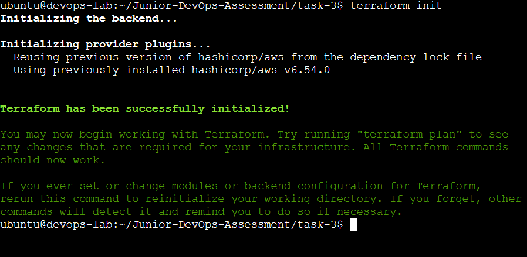
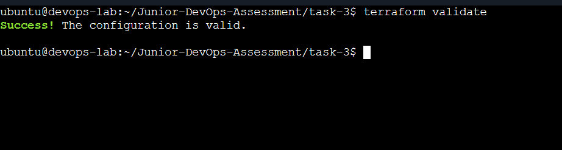
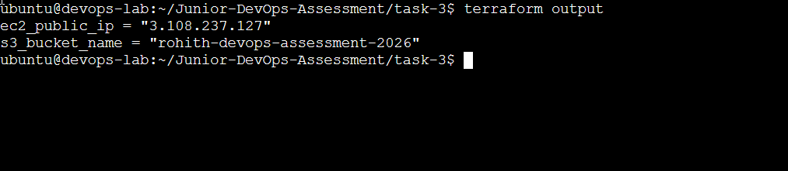
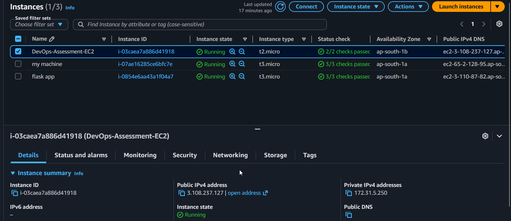
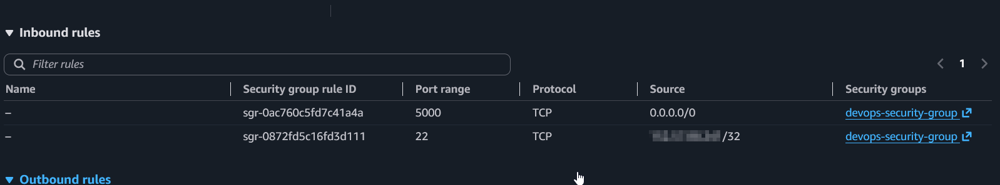
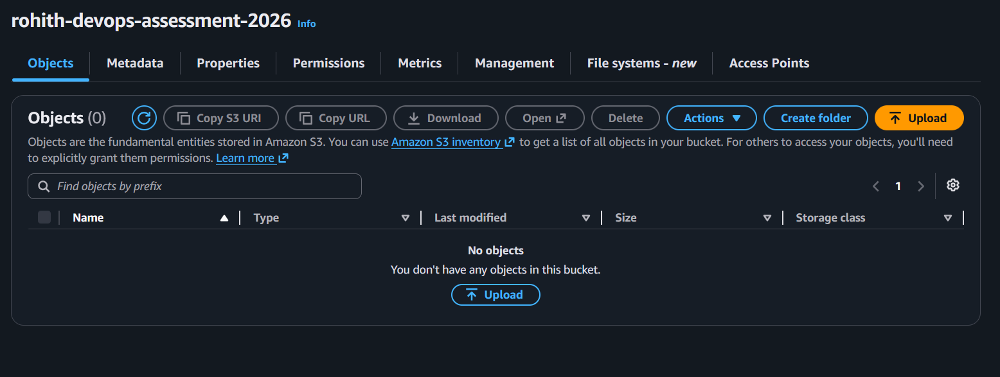
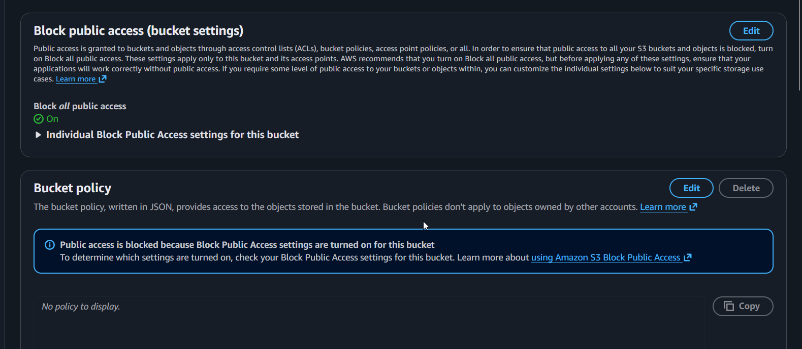

# Task 3 - Provision AWS Infrastructure Using Terraform

## Objective

Provision AWS infrastructure using Terraform by creating an EC2 instance, an S3 bucket with public access blocked, and a Security Group. Validate the configuration, generate an execution plan, and deploy the infrastructure using Infrastructure as Code (IaC).

---

## Prerequisites

- AWS Account
- Ubuntu/Linux
- Terraform
- AWS CLI
- IAM User with programmatic access
- SSH Key Pair

---

## Terraform Files

### main.tf

Defines the AWS infrastructure, including:

- AWS Provider
- Ubuntu AMI Data Source
- S3 Bucket
- S3 Public Access Block
- Default VPC Data Source
- Security Group
- EC2 Instance

### variables.tf

Declares configurable variables:

- AWS Region
- EC2 Instance Type
- Public IP for SSH access

### terraform.tfvars

Stores the values for the declared variables.

### outputs.tf

Displays:

- EC2 Public IP
- S3 Bucket Name

---

## Deployment Steps

### 1. Initialize Terraform

```bash
terraform init
```

Downloads the required provider plugins and initializes the working directory.

---

### 2. Format the Configuration

```bash
terraform fmt
```

Formats Terraform configuration files according to the standard style.

---

### 3. Validate the Configuration

```bash
terraform validate
```

Validates the Terraform configuration for syntax and logical correctness.

---

### 4. Generate an Execution Plan

```bash
terraform plan -out=tfplan
```

Creates and saves the execution plan.

---

### 5. Deploy the Infrastructure

```bash
terraform apply tfplan
```

Creates the AWS infrastructure defined in the Terraform configuration.

---

### 6. View Outputs

```bash
terraform output
```

Displays:

- EC2 Public IP
- S3 Bucket Name

---

## Resources Created

- EC2 Instance (Ubuntu)
- Security Group
  - SSH (Port 22) allowed only from my public IP
  - HTTP (Port 5000) allowed from anywhere
- S3 Bucket
- S3 Public Access Block

---

## Outputs

- EC2 Public IP
- S3 Bucket Name

---

## Screenshots

### Terraform Initialization



### Terraform Validation



### Terraform Outputs



### EC2 Instance Running



### Security Group Rules



### S3 Bucket Created



### S3 Public Access Block



---

## Outcome

Successfully provisioned AWS infrastructure using Terraform by deploying an EC2 instance, configuring a Security Group, creating an S3 bucket with public access blocked, and validating the deployment using Terraform plan, apply, and output commands.
